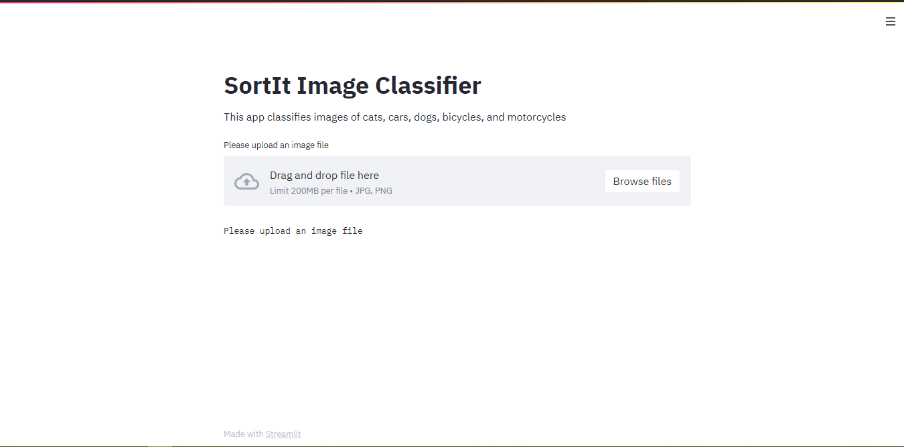

# Sort-it-Image-Classifier  :camera:
Sort-it is an image classification application that classifies images of cats, dogs, bicycles, cars, and motorcycles. 
I built it using transfer learning from Google's Inception v3 model from the ImageNet Recognition Challenge

# Live Build
wanna try it out for yourself? upload an image to http://sort-it.herokuapp.com/ and check it out!

#################################
# Local setup

HOW TO RUN
1. clone the repo

2. Download the model from the releases link and save it in the same directory as the sortit python file

3. make sure you have the following libraries installed:
    * streamlit
    * tensorflow
    * Pillow
    * openCV
    * Numpy

4. In your python cli or virtual environment run "streamlit run sortit.py"

5. It will open up a browser page running on a localhost server like this :point_down:
   

6. Proceed to upload an image and see the classification results!

